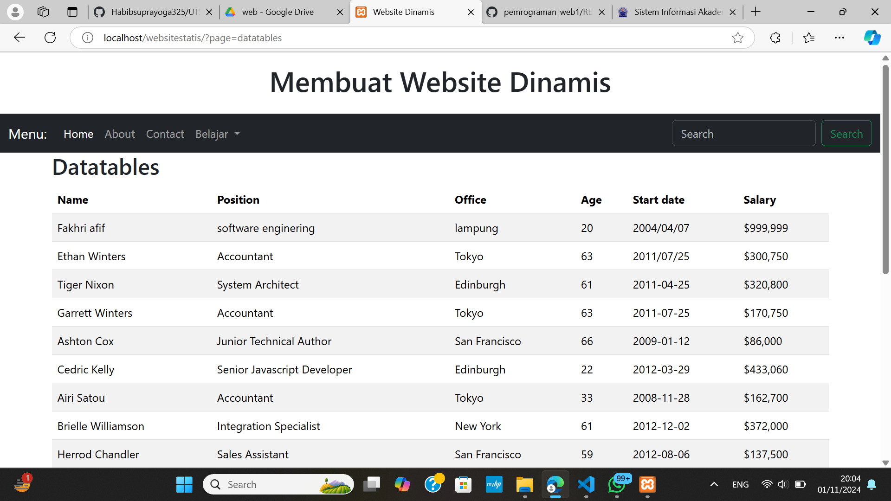

# Website_Statis
```
NIM    :312310632
NAMA   :FAKHRI AFIF
KELAS  :TI.23.A6
MATKUL:Pemrograman web 1
```
## Gambar Halaman Home

  ```
<h1>Halaman Home</h1>
```

## Gambar Halaman Form

```
<!doctype html>
<html lang="en">

<head>
  <meta charset="utf-8">
  <meta name="viewport" content="width=device-width, initial-scale=1">
  <title>Bootstrap demo</title>
  <link href="https://cdn.jsdelivr.net/npm/bootstrap@5.3.3/dist/css/bootstrap.min.css" rel="stylesheet"
    integrity="sha384-QWTKZyjpPEjISv5WaRU9OFeRpok6YctnYmDr5pNlyT2bRjXh0JMhjY6hW+ALEwIH" crossorigin="anonymous">
</head>

<body>
  <h1>Halaman Form</h1>
  <form>
    <div class="mb-3">
      <label for="exampleInputEmail1" class="form-label">Email address</label>
      <input type="email" class="form-control" id="exampleInputEmail1" aria-describedby="emailHelp">
      <div id="emailHelp" class="form-text">We'll never share your email with anyone else.</div>
    </div>
    <div class="mb-3">
      <label for="exampleInputPassword1" class="form-label">Password</label>
      <input type="password" class="form-control" id="exampleInputPassword1">
    </div>
    <div class="mb-3 form-check">
      <input type="checkbox" class="form-check-input" id="exampleCheck1">
      <label class="form-check-label" for="exampleCheck1">Check me out</label>
    </div>
    <button type="submit" class="btn btn-primary">Submit</button>
  </form>
  <script src="https://cdn.jsdelivr.net/npm/bootstrap@5.3.3/dist/js/bootstrap.bundle.min.js"
    integrity="sha384-YvpcrYf0tY3lHB60NNkmXc5s9fDVZLESaAA55NDzOxhy9GkcIdslK1eN7N6jIeHz" crossorigin="anonymous">
  </script>
</body>

</html>
```
## Gambar Halaman DataTables

```
<h2>Datatables</h2>
<!-- Example DataTable -->
<table id="example" class="table table-striped" style="width:100%">
  <thead>
    <tr>
      <th>Name</th>
      <th>Position</th>
      <th>Office</th>
      <th>Age</th>
      <th>Start date</th>
      <th>Salary</th>
    </tr>
  </thead>
  <tbody>
    <tr>
      <td>Fakhri afif</td>
      <td>software enginering</td>
      <td>lampung</td>
      <td>20</td>
      <td>2004/04/07</td>
      <td>$999,999</td>
    </tr>
    <tr>
      <td>Ethan Winters</td>
      <td>Accountant</td>
      <td>Tokyo</td>
      <td>63</td>
      <td>2011/07/25</td>
      <td>$300,750</td>
    </tr>
    <tr>
      <td>Tiger Nixon</td>
      <td>System Architect</td>
      <td>Edinburgh</td>
      <td>61</td>
      <td>2011-04-25</td>
      <td>$320,800</td>
    </tr>
    <tr>
      <td>Garrett Winters</td>
      <td>Accountant</td>
      <td>Tokyo</td>
      <td>63</td>
      <td>2011-07-25</td>
      <td>$170,750</td>
    </tr>
    <tr>
      <td>Ashton Cox</td>
      <td>Junior Technical Author</td>
      <td>San Francisco</td>
      <td>66</td>
      <td>2009-01-12</td>
      <td>$86,000</td>
    </tr>
    <tr>
      <td>Cedric Kelly</td>
      <td>Senior Javascript Developer</td>
      <td>Edinburgh</td>
      <td>22</td>
      <td>2012-03-29</td>
      <td>$433,060</td>
    </tr>
    <tr>
      <td>Airi Satou</td>
      <td>Accountant</td>
      <td>Tokyo</td>
      <td>33</td>
      <td>2008-11-28</td>
      <td>$162,700</td>
    </tr>
    <tr>
      <td>Brielle Williamson</td>
      <td>Integration Specialist</td>
      <td>New York</td>
      <td>61</td>
      <td>2012-12-02</td>
      <td>$372,000</td>
    </tr>
    <tr>
      <td>Herrod Chandler</td>
      <td>Sales Assistant</td>
      <td>San Francisco</td>
      <td>59</td>
      <td>2012-08-06</td>
      <td>$137,500</td>
    </tr>
    <tr>
      <td>Rhona Davidson</td>
      <td>Integration Specialist</td>
      <td>Tokyo</td>
      <td>55</td>
      <td>2010-10-14</td>
      <td>$327,900</td>
    </tr>
    <tr>
      <td>Colleen Hurst</td>
      <td>Javascript Developer</td>
      <td>San Francisco</td>
      <td>39</td>
      <td>2009-09-15</td>
      <td>$205,500</td>
    </tr>
    <tr>
      <td>Sonya Frost</td>
      <td>Software Engineer</td>
      <td>Edinburgh</td>
      <td>23</td>
      <td>2008-12-13</td>
      <td>$103,600</td>
    </tr>
    <tr>
      <td>Jena Gaines</td>
      <td>Office Manager</td>
      <td>London</td>
      <td>30</td>
      <td>2008-12-19</td>
      <td>$90,560</td>
    </tr>
    <tr>
      <td>Quinn Flynn</td>
      <td>Support Lead</td>
      <td>Edinburgh</td>
      <td>22</td>
      <td>2013-03-03</td>
      <td>$342,000</td>
    </tr>
    <tr>
      <td>Charde Marshall</td>
      <td>Regional Director</td>
      <td>San Francisco</td>
      <td>36</td>
      <td>2008-10-16</td>
      <td>$470,600</td>
    </tr>
    <tr>
      <td>Haley Kennedy</td>
      <td>Senior Marketing Designer</td>
      <td>London</td>
      <td>43</td>
      <td>2012-12-18</td>
      <td>$313,500</td>
    </tr>
  </tbody>
</table>
```
