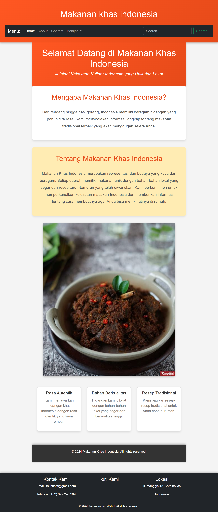
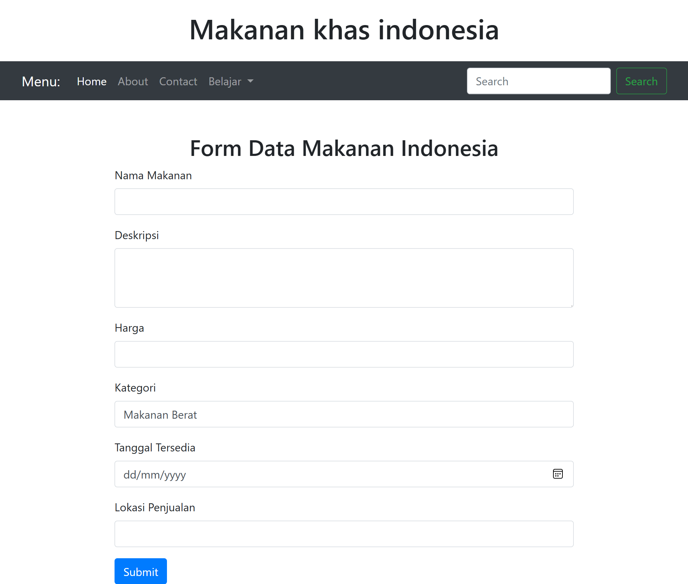
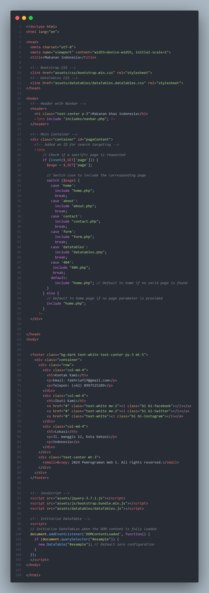

# Website_Dinamis
```
NIM    :312310632
NAMA   :FAKHRI AFIF
KELAS  :TI.23.A6
MATKUL:Pemrograman web 1
```
## Gambar Halaman Home

```
Struktur Halaman
Deklarasi HTML dan Elemen Dasar:

Kode diawali dengan deklarasi <!DOCTYPE html> yang menunjukkan bahwa ini adalah dokumen HTML5.
Elemen <html> dengan atribut lang="en" menandakan bahwa konten halaman menggunakan bahasa Inggris, meskipun isi kontennya dalam bahasa Indonesia.
Bagian <head>:

Di dalam tag <head>, terdapat beberapa elemen:
<meta charset="UTF-8">: Mengatur karakter encoding ke UTF-8 untuk mendukung berbagai karakter.
<meta name="viewport" content="width=device-width, initial-scale=1.0">: Memastikan tampilan responsif di perangkat mobile.
<title>: Menentukan judul halaman yang ditampilkan di tab browser.
<style>: Berisi CSS yang mengatur gaya dan tata letak elemen di halaman.
Bagian <body>:

Header:
Menggunakan tag <header> untuk menampilkan judul besar dan deskripsi singkat tentang makanan khas Indonesia dengan latar belakang gradasi warna.
Bagian Intro:
<div class="intro"> berisi judul dan penjelasan mengenai makanan khas Indonesia, menjelaskan keragaman dan kelezatan kuliner.
Slider:
<div class="slider"> menampilkan gambar makanan khas Indonesia dengan efek slide. Gambar diambil dari URL eksternal dan diatur untuk tampil secara otomatis setiap 3 detik.
Fitur:
Bagian <section class="features"> menyajikan informasi tentang keunggulan makanan khas Indonesia dalam bentuk tiga fitur: Rasa Autentik, Bahan Berkualitas, dan Resep Tradisional.
Footer:
<footer> menampilkan informasi hak cipta dan dapat digunakan untuk menyampaikan informasi tambahan.

Gaya CSS
CSS di dalam tag <style> digunakan untuk mengatur elemen-elemen seperti:
Margin, padding, dan box-sizing untuk elemen global.
Gaya untuk header, termasuk latar belakang dan warna teks.
Penataan untuk fitur dengan efek hover yang memberikan interaksi visual.
Gaya untuk slider agar gambar tampil dengan baik dan responsif.

Skrip JavaScript
Skrip di akhir body menggunakan JavaScript untuk mengatur fungsionalitas slider:
Menyimpan indeks slide saat ini dan menghitung total slide.
Fungsi showNextSlide digunakan untuk menampilkan slide berikutnya dengan memindahkan posisi slider.
setInterval digunakan untuk memanggil fungsi showNextSlide setiap 3 detik, memberikan efek otomatis pada slider.
```

## gambar About

```
Struktur Halaman
Deklarasi HTML dan Elemen Dasar:

Kode dimulai dengan deklarasi <!DOCTYPE html>, yang menunjukkan bahwa ini adalah dokumen HTML5.
Elemen <html> memiliki atribut lang="en", menandakan bahwa konten halaman menggunakan bahasa Inggris, meskipun isi konten sebenarnya dalam bahasa Indonesia.
Bagian <head>:

Di dalam tag <head>, terdapat beberapa elemen penting:
<meta charset="UTF-8">: Mengatur karakter encoding ke UTF-8 untuk mendukung berbagai karakter internasional.
<meta name="viewport" content="width=device-width, initial-scale=1.0">: Memastikan tampilan responsif di perangkat mobile dengan mengatur lebar viewport.
<title>: Menentukan judul halaman yang akan ditampilkan di tab browser.
<style>: Berisi CSS yang mengatur gaya dan tata letak elemen di halaman.
Bagian <body>:

Header:
Menggunakan tag <header> untuk menampilkan judul dan deskripsi singkat tentang makanan khas Indonesia dengan latar belakang bergradasi warna.
Bagian Intro:
<div class="intro"> berisi judul dan penjelasan mengenai mengapa makanan khas Indonesia itu istimewa, menyoroti keragaman hidangan yang lezat.
Bagian Tentang:
<div class="about"> memberikan informasi lebih dalam mengenai makanan khas Indonesia, menekankan keberagaman budaya dan bahan lokal yang digunakan dalam masakan.
Slider:
<div class="slider"> menampilkan gambar-gambar makanan khas Indonesia dengan efek slide otomatis. Gambar diambil dari URL eksternal dan akan berubah setiap 3 detik.
Fitur:
Bagian <section class="features"> menyajikan informasi tentang tiga keunggulan makanan khas Indonesia: Rasa Autentik, Bahan Berkualitas, dan Resep Tradisional.
Footer:
<footer> menampilkan informasi hak cipta dan catatan mengenai halaman tersebut.

Gaya CSS
CSS di dalam tag <style> digunakan untuk mengatur tampilan elemen-elemen di halaman:
Mengatur margin, padding, dan box-sizing untuk semua elemen secara global.
Mengatur gaya untuk header, termasuk latar belakang dan warna teks.
Menambahkan gaya khusus pada bagian intro dan tentang agar terlihat menonjol dengan latar belakang berbeda dan bayangan.
Menyusun fitur dalam bentuk grid fleksibel yang responsif dan memberikan efek hover yang menarik pada elemen fitur.

Skrip JavaScript
Skrip di akhir body menggunakan JavaScript untuk mengatur fungsionalitas slider:
Menyimpan indeks slide saat ini dan menghitung jumlah total slide.
Fungsi showNextSlide digunakan untuk menampilkan slide berikutnya dengan menggeser posisi slider.
setInterval digunakan untuk memanggil fungsi showNextSlide setiap 3 detik, menciptakan efek otomatis pada slider.
```
## Gambar Contact


## Gambar Form

## Gambar Form.Php


## Gambar Data Table

## Gambar datatables.php


## Gambar Index.Php

